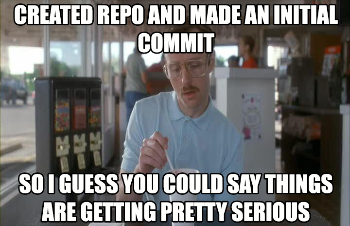

# git-workshop
### GW Libraries Github Workshop Collaboration Test

Welcome to the Fall 2017 _**GW Libraries GitHub workshop**_!

We're going to use this repository to practice collaborating on a github repository (without forking).  We'll get to forking later.

Here's a list of instructors here today:
- Dan Kerchner
- Justin Littman
- Kean McDermott

Here is a list of workshop participants here today:
- Max Starkenburg
- Kyle Kelly
- **EDIT ME!!**

